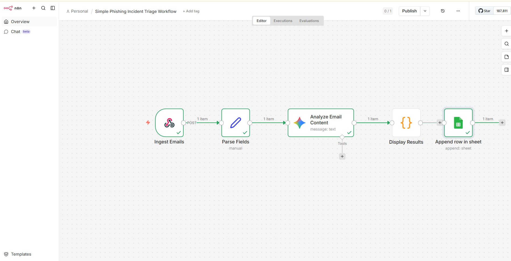

# Week 2 — Phishing Triage Workflow + Google Sheets Logging

## Task Description
Import the provided n8n phishing triage workflow, review and confirm it runs correctly, then extend it by adding a Google Sheets node to log each analyzed email as an incident record after the AI analysis stage.

## Setup Method
Docker Desktop + ngrok (for webhook tunneling)

---

## Step-by-Step Setup

### Step 1 — Import the Phishing Triage Workflow
Imported the "Simple Phishing Incident Triage Workflow" into n8n at `http://localhost:5678`.

**Workflow nodes:**
| Node | Purpose |
|------|---------|
| Ingest Emails | Webhook trigger (POST) |
| Parse Fields | Manual field extraction |
| Analyze Email Content | AI analysis using Gemini |
| Display Results | Output formatter |

### Step 2 — Set Up ngrok for Webhook Tunneling
Since n8n runs locally, ngrok was used to expose the webhook endpoint publicly:
```bash
ngrok http 5678
```
ngrok creates a public forwarding URL in the format:
```
https://<random-subdomain>.ngrok-free.dev -> http://localhost:5678
```
HTTP requests are logged in the ngrok terminal, confirming webhook traffic hitting the `/webhook-test/security-inbox` endpoint.

### Step 3 — Create the Google Sheet
Created a new Google Sheet named **Phishing Incident Log** with the following column headers:

| A | B | C | D | E | F |
|---|---|---|---|---|---|
| Timestamp | Sender | Subject | Classification | Confidence | Summary |

### Step 4 — Add and Configure the Google Sheets Node
Added a Google Sheets node after the Display Results node with the following configuration:

| Setting | Value |
|---------|-------|
| Credential | Google Sheets account (OAuth) |
| Resource | Sheet Within Document |
| Operation | Append Row |
| Document | Phishing Incident Log |
| Sheet | Sheet1 |
| Mapping Mode | Map Each Column Manually |

**Column mappings:**
```
Timestamp      → {{ $now }}
Sender         → {{ JSON.parse($json.content.parts[0].text).sender_email }}
Subject        → {{ JSON.parse($json.content.parts[0].text).subject }}
Classification → {{ JSON.parse($json.content.parts[0].text).phishing_likely }}
Confidence     → {{ JSON.parse($json.content.parts[0].text).risk_score }}
Summary        → {{ JSON.parse($json.content.parts[0].text).summary }}
```

### Step 5 — Test the Full Workflow End-to-End
Executed the workflow with a sample phishing email to verify end-to-end functionality. The AI analysis node classified the email and the Google Sheets node successfully appended the result as a new row.

### Step 6 — Verify Incident Logged in Google Sheets
Confirmed the Google Sheet was successfully populated with all fields:

| Timestamp | Sender | Subject | Classification | Confidence | Summary |
|-----------|--------|---------|----------------|------------|---------|
| 2026-05-14T11:29:13 | [test-email] | [test-subject] | TRUE | 55 | AI-generated summary of the email content... |

---

## Outcome
The phishing triage workflow was successfully imported, extended, and tested. After the AI analysis stage, the Google Sheets node now automatically logs each analyzed email as an incident record in the Phishing Incident Log spreadsheet. The workflow correctly captured the sender, subject, phishing classification (TRUE), confidence score (55), and a full AI-generated summary.

---

## Screenshots

| File | Description |
|------|-------------|
| `workflow.png` | n8n workflow showing all nodes including the Google Sheets node (green checkmarks) |
| `3.png` | n8n workflow showing the Google Sheets node added after the AI analysis stage |
| `1.png / 2.png` | ngrok terminal showing the webhook tunnel active and HTTP requests received |
| `one_sample_incident_successfully_logged.png` | Google Sheets node output showing successfully mapped incident data |
| `excel-logging.png` | Google Sheet showing the incident row logged with all fields populated |

## Workflow Preview


